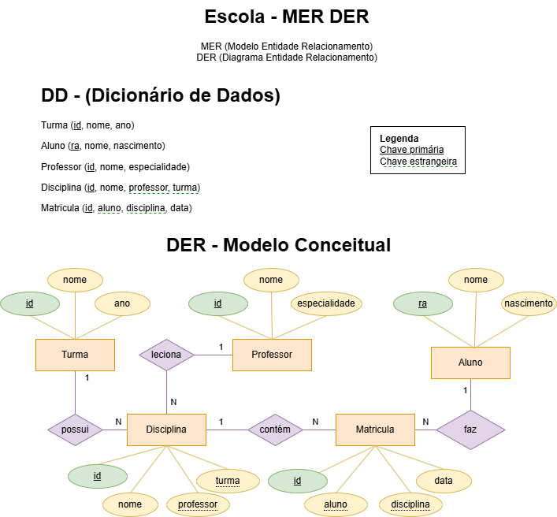
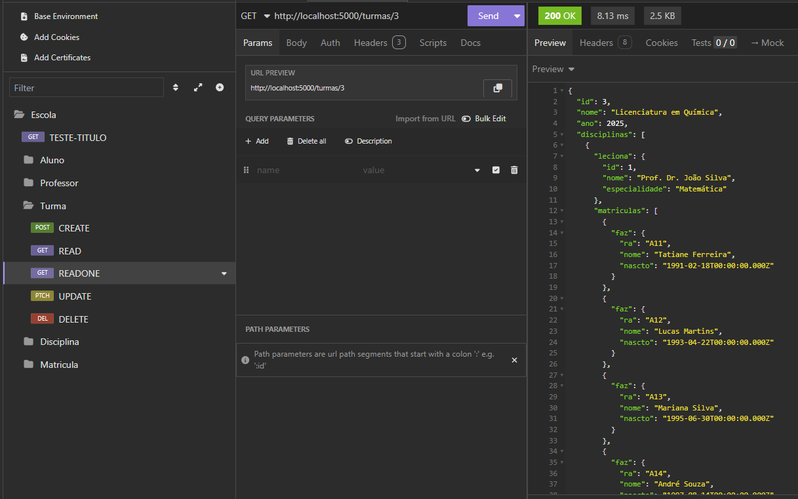

# Escola Superior PW
Exemplo de sistema back-end Node.JS utilizando o ORM **Prisma**, criando o banco de dados e semeando dados de teste
- Prisma seed
- Testes com Insomnia

## Tecnologias
- Node.js
- Prisma
- VsCode
- MySQL
- Insomnia

## MER - DER


## Requisitos funcionais
- [RF001] CRUD de Alunos
- [RF002] CRUD de Professores
- [RF003] CRUD de Turmas
- [RF004] CRUD de Disciplinas
- [RF005] CRUD de Matrículas
- 

## Passo a passo para testar
- 1 Clone este repositório
- 2 Abra o repositório com o VsCode, Abra um terminal **CTRL + '** cmd ou bash
- 3 Abra o XAMPP e inicie o SGBD **MySQL**, ou inicie o MySQL da forma que preferir.
- 4 Crie dentro da pasta ./api um arquivo chamado **.env** contendo as seguintes variáveis de ambiente:
```js
DATABASE_URL="mysql://root@localhost:3306/escola?schema=public&timezone=UTC"
```
- 5 No terminal do VsCode navegue até a pasta **./api** e execute os seguintes comandos para instalar o banco de dados, semear os dados de teste e executar a API na porta 5000.
```bash
cd api
npm i prisma -g
npm install
npx prisma init --datasource-provider mysql
npx nodemon
```
- 6 Abra o insominia e importe os testes do aquivo **./docs/insomnia.yaml**

## Testes
- O sistema já possui cadastrados:
- 15 alunos
- 3 Turmas
- 5 Disciplinas por turma
- 5 alunos matriculados em todas as 5 disciplinas de cada uma das três turmas, totalizando 75 matrículas.
- Cadastre, Liste, Altere e Exclua 1 Aluno
- Cadastre, Liste, Altere e Exclua 1 Professor
- Cadastre, Liste, Altere e Exclua 1 Turma
- Cadastre, Liste, Altere e Exclua 1 Disciplina
- Cadastre, Liste, Altere e Exclua 1 Matrícula
